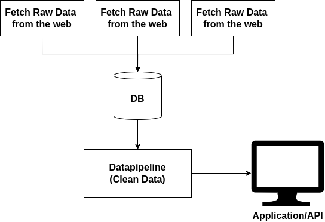

## How would you automate the ingress of data to not repeat any manual adjustments done?

There are various ways to do this. I think it depends very much on who and how many people provide the input for these manual adjustments. I also think it is difficult to choose a general approach, as this depends heavily on the anomalies. Basically, I think you can extract the raw data with the errors in a first step and then clean the data with the known anomalies in a second step. I think this is easier than applying the adjustments directly to the raw data, as the data is at least in a predefined schema and is easier to follow. 
I think data should be processed in several steps. So one step in a data pipeline could be to fix the anomalies of a particular data source. With a tool like dbt, for example, you can run the data pipeline at any time and adjust and easily add anomalies. The only prerequisite for this is that the raw data is stored in one place.

## Please present an architecture design for a system that automates the ingress and updates of an increasingly large number of datasets.

The architecture depends heavily on how frequently the data is updated. I assume that the data is updated a maximum of a few times a day. In the case of real-time data, you would need to take a different approach. One option is to write a connector for a data source that writes the data to a central database. These connectors can pull the data from the Internet at predefined intervals, depending on how often the data is updated. Depending on the data source, there are tools for writing this data to the database, but it is also no problem to implement your own connectors. The processed data in the database can then be displayed in an application, but can also be analyzed in detail. I think this is very important, as it allows errors to be detected quickly. The data pipeline can then be executed with every update so that the calculations based on it are always up-to-date.

## List out future improvements, experiments, edge cases and how they can be managed.

In my experience, a comprehensive notification system has helped to quickly detect errors, so that you are notified, for example, as soon as a connector could not successfully save the data or if, for example, certain constraints are missing.

Depending on what the data sources are and how the data is provided, you could consider running the data via an event system such as Kafka and processing the data directly with Kafka Streams. The data can be provided much faster and it is easier to expand.

The best case scenario would be if the data could be adjusted directly from the application or a dashboard and the data pipeline could also be triggered by manual changes.